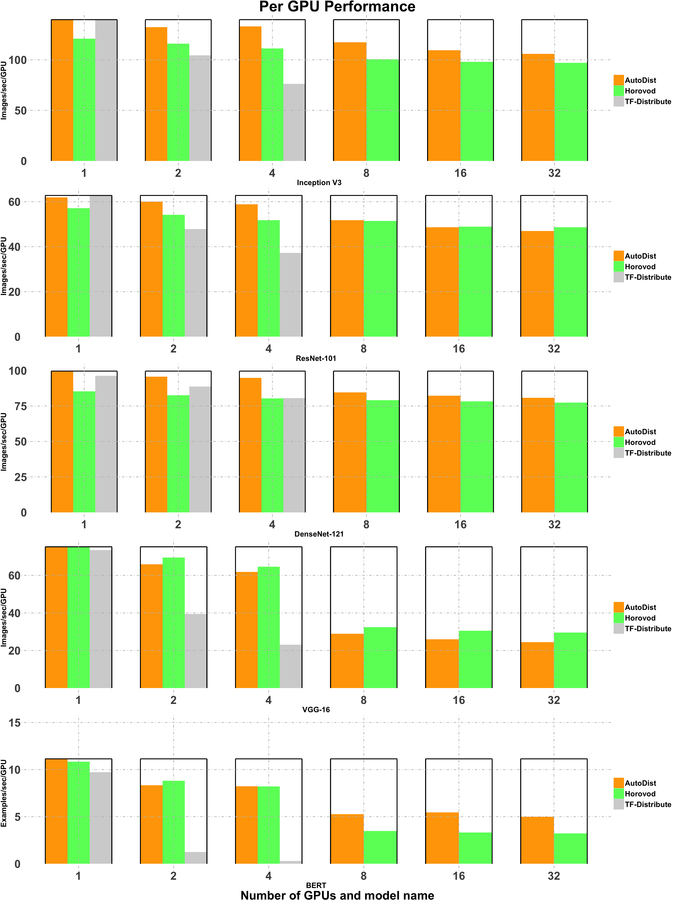
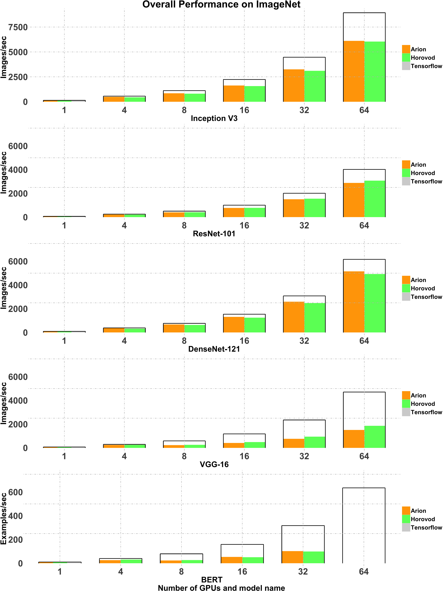

<p align="center"></p>

[](https://jenkins.petuum.io/job/AutoDist/job/master/)
[](https://jenkins.petuum.io/job/AutoDist/job/master/lastSuccessfulBuild/artifact/)
[](https://pypi.org/project/autodist/)

[Documentation](https://petuum.github.io/autodist) |
[Examples](https://github.com/petuum/autodist/tree/master/examples/benchmark)

**AutoDist** is a distributed deep learning training engine for TensorFlow. AutoDist provides a user-friendly interface to distribute the training of a wide variety deep learning models across many GPUs with scalability and minimal code change.

## Introduction
Different from specialized distributed ML systems, AutoDist is created to speed up a broad range of DL models with excellent all-round performance.
AutoDist achieves this goal by:
- **Compilation**: AutoDist expresses the parallelization of DL models as a standardized compilation process, optimizing multiple dimensions of ML
parallelization including synchronization, partitioning, placement etc.
- **Composable architecture**: AutoDist contains a flexible backend that can express various different ML parallelization techniques and
allows for composing distribution strategies that blend different distributed ML system architectures.
- **Model and resource awareness**: Based on the compilation process, AutoDist analyzes the model and generates more optimal distribution strategies that
adapt to both the model properties and the cluster specification.

Besides all these advanced features, AutoDist is designed to isolate the sophistication of distributed systems
from ML prototyping and exposes a simple API that makes it easy to use and switch between different distributed ML techniques
for users of all levels.

<p align="center"></p>

For a closer look at the performance, please refer to our [doc](https://petuum.github.io/autodist/usage/performance.html).

## Using AutoDist

Installation:

```bash
pip install autodist
```

Modifying existing TensorFlow code to use AutoDist is easy:

```python
import tensorflow as tf
from autodist import AutoDist

ad = AutoDist(resource_spec_file="resource_spec.yml")

with tf.Graph().as_default(), ad.scope():
    ########################################################
    # Build your (single-device) model here,
    #   and train it distributedly.
    ########################################################
    sess = ad.create_distributed_session()
    sess.run(...)
```
Ready to try? Please refer to the examples in our [Getting Started page](https://petuum.github.io/autodist/usage/tutorials/getting-started.html).

## References & Acknowledgements

We learned and borrowed insights from a few open source projects
including
[Horovod](https://github.com/horovod/horovod),
[Parallax](https://github.com/snuspl/parallax),
and [tf.distribute](https://github.com/tensorflow/tensorflow/tree/master/tensorflow/python/distribute).
