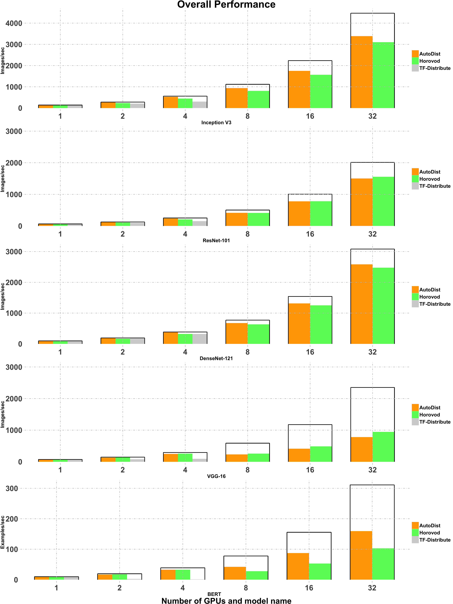

<p align="center"></p>

[](https://github.com/petuum/autodist/commits/master)
[](https://github.com/petuum/autodist/commits/master)

[Documentation](https://petuum.github.io/autodist) |
[Examples](https://github.com/petuum/autodist/tree/master/examples/benchmark)

**AutoDist** is a distributed deep-learning training engine. 
AutoDist provides a user-friendly interface to distribute the training of a wide variety of deep learning models 
across many GPUs with scalability and minimal code change.

AutoDist has been tested with TensorFlow versions 1.15 through 2.1. 

## Introduction
Different from specialized distributed ML systems, AutoDist is created to speed up a broad range of DL models with excellent all-around performance.
AutoDist achieves this goal by:
- **Compilation**: AutoDist expresses the parallelization of DL models as a standardized compilation process, optimizing multiple dimensions of ML 
parallelization including synchronization, partitioning, placement etc. 
- **Composable architecture**: AutoDist designs a flexible backend that encapsulates various different ML parallelization techniques and 
allows for composing distribution strategies that interpolate different distributed ML system architectures.     
- **Model and resource awareness**: Based on the compilation process, AutoDist analyzes the model and generates more optimal distribution strategies that 
adapt to both the ML properties and the cluster specification.

Besides all these advanced features, AutoDist is designed to isolate the sophistication of distributed systems 
from ML prototyping and exposes a simple API that makes it easy to use and switch between different distributed ML techniques 
for all-level users.

<p float="left"></p>

## Using AutoDist

Installation:

```bash
pip install autodist
```

Modifying existing TensorFlow code to use AutoDist is easy.

```python
import tensorflow as tf
from autodist import AutoDist

ad = AutoDist(resource_spec_file="resource_spec.yml")

with tf.Graph().as_default(), ad.scope():
    ########################################################
    # Build your (single-device) model here, 
    #   and train it distributedly.
    ########################################################
    sess = ad.create_distributed_session()
    sess.run(...)
```

## References & Acknowledgements

We learned and borrowed insights from a few open source projects 
including
[Horovod](https://github.com/horovod/horovod),
[Parallax](https://github.com/snuspl/parallax),
[tf.distribute](https://github.com/tensorflow/tensorflow/tree/master/tensorflow/python/distribute).
