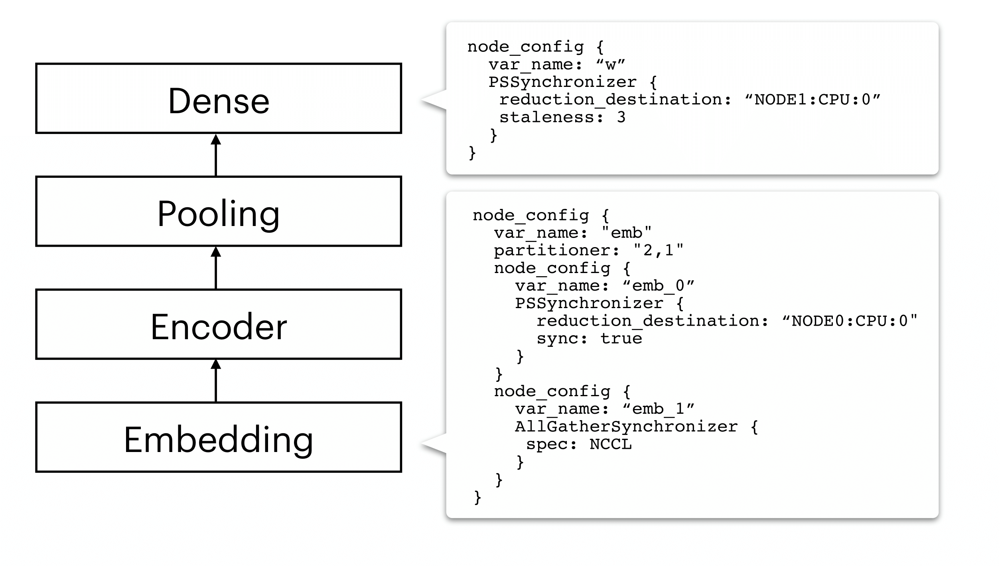
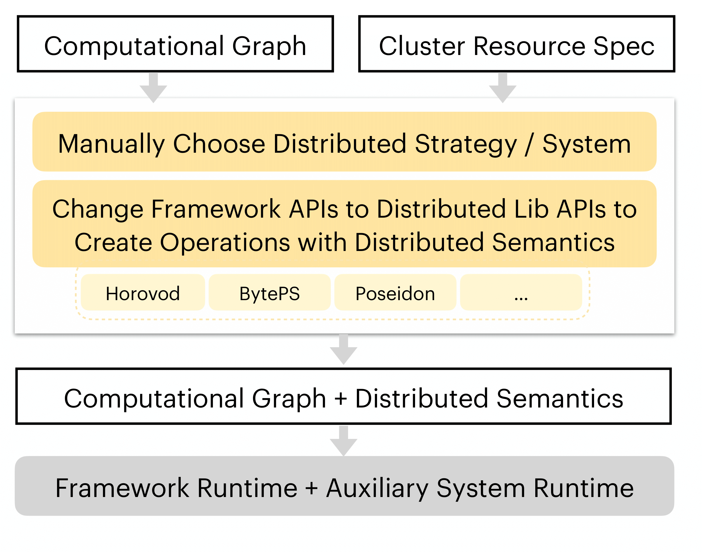

Rationale
=============

Motivation
----------

As machine learning models become more structurally complex, existing distributed ML systems have struggled to provide
excellent *all-round* performance on a wide variety of models, since most of them are specialized upon one monolithic system architecture or technology.
For example, Horovod is built upon MPI and AllReduce and believed to work well with dense parameter variables like those found in CNNs, but exhibits limitations on
synchronizing sparse parameter variables like the embedding layers found in many NLP models. In contrast, many Parameter Server based systems are reported to be better-suited to NLP models than CNNs.

Unlike existing systems, AutoDist is motivated by the fact that different ML models (or different components in a complex model) exhibit different runtime characteristics and that different learning algorithms demonstrate distinct computational patterns. This means that for high distributed execution performance, we need a model and algorithm-aware system.

AutoDist distributes an incoming model by first analyzing the computational graph of the model. Depending on the characteristics of the model's building blocks and resource specifications, AutoDist achieves adaptiveness by composing various,  atomic distributed ML techniques together into a *distribution strategy*, a unified model- and resource-dependent representation which instructs how the model should be parallelized on the target cluster. It then transforms the original single-node computational graph based on the generated strategy to a distributed one running on distributed clusters.

Rationale and Features
-----------------------

In designing AutoDist, we focused on the *composability* and *reusability* of individual ML parallelization building blocks, as well as extensibility to handle future emerging distributed ML techniques.

The figure below contrasts most existing distributed ML systems (upper) with AutoDist (lower).

.. image:: images/autodist-arch.png
  :align: center
  :width: 450 px
  :alt: Ours

AutoDist offers the following competitive features over existing parallel ML training systems:

- **Unified representation for DL parallelization**. AutoDist develops a unified representation that encodes multiple contributing factors to DL parallelization performance. The strategy is explicitly represented, executable by low-level systems, and transferable across users.

- **Composable system architecture.** AutoDist allows for strategy composition -- each aspect of DL parallelization maps to a primitive dataflow graph-rewriting kernel in the backend system. A complete synchronization strategy is hence materialized by composing multiple primitive kernels, based on the strategy representation. This approach isolates strategy prototyping from low-level distributed systems; allows composition, assessment and execution of complex synchronization strategies via a unified interface; and is extensible to emerging synchronization techniques.

- **Automatic strategy optimization**. The introduced representation spans a combinatorial space enclosing all possible strategies (i.e. assignments of parallelization aspects to model building blocks). AutoDist builds a strategy auto-optimization pipeline to efficiently optimize strategies against model and resources, which not only improves parallel performance, but is also an added convenience for users. The optimizer is built on top of both principled system modeling and a data-driven ML models trained on low-shot trial-run data, and can improve as more data is acquired.

