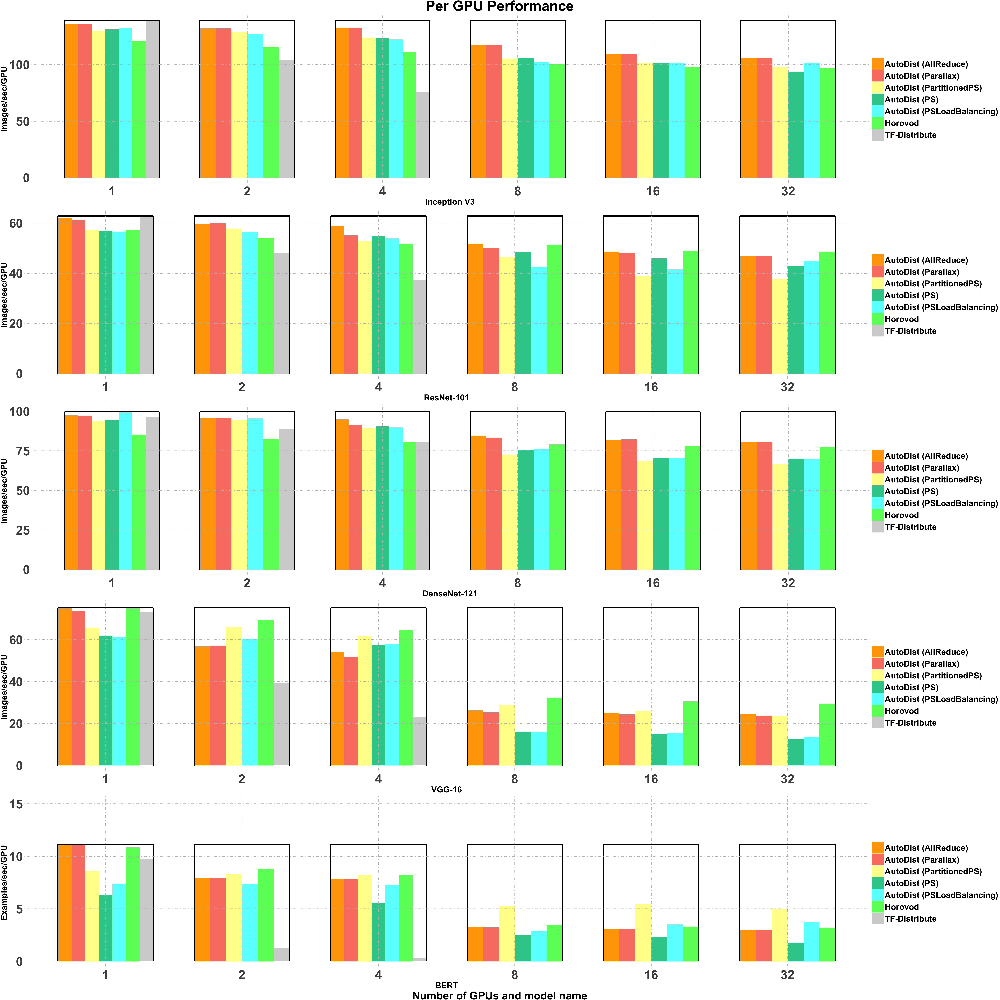

# Performance Analysis of AutoDist
The primary motivation of AutoDist is to build a scalable ML engine for distributed TensorFlow model training. AutoDist provides different distributed training strategies that also inlcude some latest distributed strategies. In order to report the performance of AutoDist for different strategies across different deep learning models, we benchmark its performance with Tensorflow and a state-of-the-art distributed training framework.

## Experiment Setup

### Dataset and Model
We benchmark AutoDist with Horovod on the dataset of ImageNet across ResNet101, DenseNet121, InceptionV3 and VGG16, which are four state-of-the-arts convolutional neural networks, and also on a sample dataset for pre-training the BERT-large, uncased model (https://github.com/google-research/bert). Our experiments were done with at most sixteen AWS server instances with type g4dn.12xlarge which have 4 NVIDIA T4 GPUs each connected by a 50 Gbit/s network. In order to show the performance under different scale of GPUs, we respectively perform experiments with one server, two servers, four servers, eight servers and sixteen servers. All the experiments were performed in Tensorflow 2.0.1 with CUDA 10.0.130 and CUDNN 7.6.5. AutoDist and Horovod were run in the exactly same environment and setting of instances. 

### Strategy Configuration
In AutoDist, we adopt five distributed strategies: PS, PartitionedPS, PSLoadBalancing, AllReduce and Parallax. In the strategy of AllReduce and Parallax, we use Ring-based AllReduce algorithm with PowerSGD compressor and chunk size set to 512 for DenseNet121 and 256 for ResNet101. The code we use for running autodist on these experiments can be checked out following [this link](https://github.com/petuum/autodist/tree/master/examples/benchmark).

## Performance Comparison
We summarize the performance in a figure below. We can find different models achieve the best performance with different AutoDist strategy. The performance per GPU is stable with different number of used GPUs, which suggests AutoDist has a good scalability with increased GPUs.

